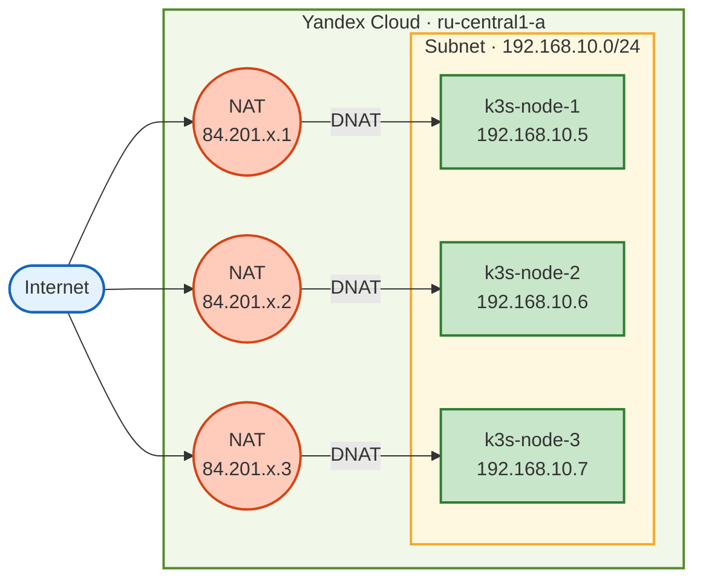

# Yandex Cloud K3s Infrastructure

Этот модуль автоматизирует создание инфраструктуры для K8s кластера (K3s) в Yandex Cloud с использовнием подхода IaC.

## Назначение 

Модуль создает готовую инфраструктуру для развёртывания K3s кластера:
- 3 виртуальные машины (1 master + 2 worker nodes)
- Автогенерация inventory.ini (Ansible)
- Интеграция с CI/CD

## Архитектура

IP адреса на схеме приведены для примера



## Структура проекта
```
devops-test-lab/
├── terraform/
│   ├── main.tf
│   ├── outputs.tf
│   ├── terraform.tfvars.example
│   ├── terraform.tf # заполняется вручную
│   └── variables.tf
├── ansible/
│   ├── inventory.ini # генерируется при запуске terraform apply
│   └── inventory.tpl
├── .gitignore
└── README.md
```

## Особенности

- Terraform генерирует файл ```inventory.ini``` в директории ```ansible/```, а также удаляет его при выполнении команды ```terraform destroy```.

## Быстрый старт
### Установка зависимостей

Инструкции по установке необходимых инструментов:
- Terraform: https://developer.hashicorp.com/terraform/install
- YC CLI: https://yandex.cloud/en/docs/cli/operations/install-cli

### Клонирование репозитория
```bash
git clone https://github.com/ephuneral/devops-test-lab.git
cd devops-test-lab/
```

### Конфигурация
```bash
# Скопировать шаблон
cp terraform.tfvars.example terraform.tfvars

# Подставить реальные значения
nano terraform.tfvars
```

### Развёртывание
```bash
# Инициализация Terraform
terraform init

# Просмотр плана
terraform plan

# Применение конфигурации
terraform apply
```

### Прсмотр результатов
```bash
# Получение IP-адреса master-ноды
terraform output master_ip

# Получение IP-адресов worker-нод
terraform output worker_ip

# Получение информации о кластере
terraform output cluster_info
```

### Удаление
```bash
terraform destroy
```