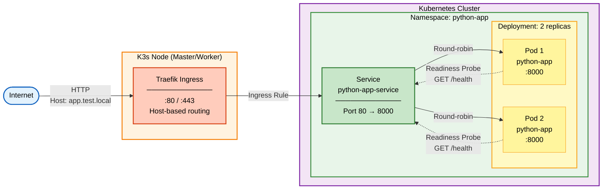

# Kubernetes: деплоймент приложения

Данный модуль содержит манифест для развёртывания python-приложения в Kubernetes-кластере (K3s). Используется Ingress контроллер Traefik.

# Назначение 

Модуль описывает деплой приложения в кластер:
- Создание Namespace
- Развёртывание с 2 репликами
- Настройка Service для внутренней маршрутизации
- Конфигурация Ingress для доступности из внешней сети

# Архитектура

Ниже представлена схема кластера с развёрнутыми приложением и Ingress. В запросах необходимо использовать заголовок `Host: app.test.local`

